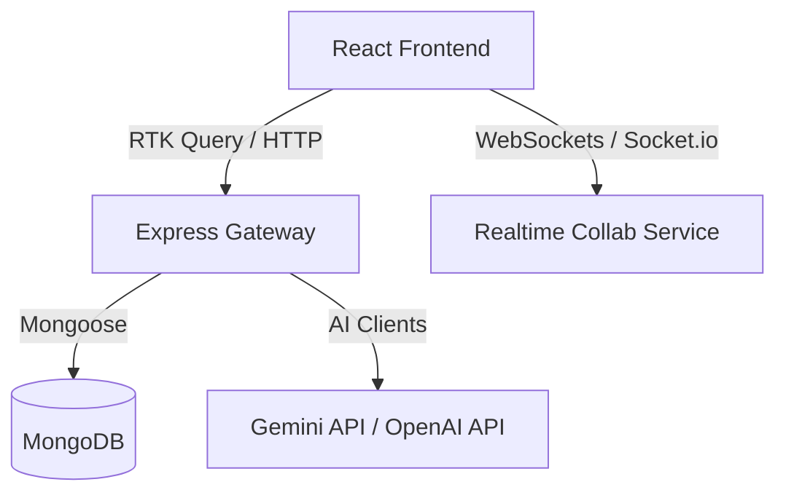

# API Integration & Communication Guide

This guide outlines how the Story Spark AI frontend communicates with the backend services via REST APIs and WebSockets.

## Architecture Overview



## 1. Authentication Flow
Endpoints handled under `/api/auth`:
- **POST** `/register` — Sign up a new user with standard credentials.
- **POST** `/login` — Authenticate user and issue authorization token cookie.
- **POST** `/logout` — Invalidate the session.
- **GET** `/profile` — Fetch current user context info.

## 2. AI Story Generation
Endpoints under `/api/ai`:
- **POST** `/generate` — Generates a story segment using the main selected engine.
- **POST** `/generate-free` — Generates a story segment using the rate-limited public engine.
- **POST** `/endings` — Generates alternative endings for an existing story draft.

### Sample Request:
```json
{
  "prompt": "A wizard looking for his lost staff in the deep woods",
  "genre": "Fantasy",
  "length": "medium",
  "language": "English",
  "tone": "Mysterious"
}
```

### Sample Response:
```json
{
  "success": true,
  "data": {
    "uuid": "story-uuid-123",
    "title": "The Whispering Woods",
    "content": "Merlin searched the dark thicket...",
    "tag": "Fantasy"
  }
}
```

## 3. WebSocket Channels
Socket.io triggers under `/collab`:
- `join-room` — Connects user to a collaborative story writing workspace.
- `edit-content` — Broadcasts live changes to the editor.
- `cursor-move` — Synchronizes editor cursor locations.
